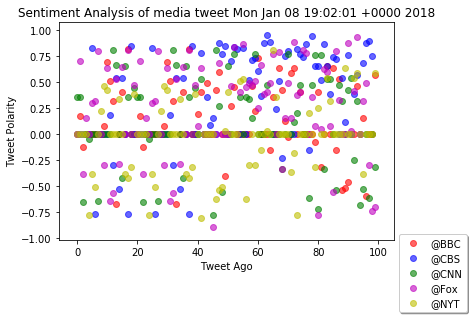
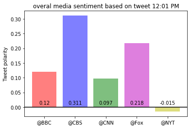


Three observable trends based on the data are:
1. Based on the different time during the day and different day of the week the result of these analysis 
   could be different for any given news organization. 
2. Between following news organizations: BBC, CBS, CNN, Fox, and New York times, NYT is the most negative one.
3. The scatter plot of all the 100 tweets of these organizations are not very readable for presenting but
   the bar graph show better how is the avarage for these organizatyion and easy to present.


## News Mood

#In this assignment, you'll create a Python script to perform a sentiment analysis of the Twitter activity 
#of various news oulets, and to present your findings visually.

#Your final output should provide a visualized summary of the sentiments expressed in Tweets sent out by 
#the following news organizations: __BBC, CBS, CNN, Fox, and New York times__.

#The first plot will be and/or feature the following:

 1. Be a scatter plot of sentiments of the last __100__ tweets sent out by each news organization,
ranging from -1.0 to 1.0, where a score of 0 expresses a neutral sentiment, -1 the most negative
sentiment possible, and +1 the most positive sentiment possible.
2. Each plot point will reflect the _compound_ sentiment of a tweet.
3. Sort each plot point by its relative timestamp.

#The second plot will be a bar plot visualizing the _overall_ sentiments of the last 100 tweets from each
#organization. For this plot, you will again aggregate the compound sentiments analyzed by VADER.

# As final considerations:

Use the Matplotlib and Seaborn libraries.
Include a written description of three observable trends based on the data. 
Include proper labeling of your plots, including plot titles (with date of analysis) and axes labels.
Include an exported markdown version of your Notebook called  `README.md` in your GitHub repository.  


```


```python
# Dependencies
import tweepy
import json
import numpy as np
import pandas as pd
import matplotlib.pyplot as plt
from datetime import datetime

# Import and Initialize Sentiment Analyzer
from vaderSentiment.vaderSentiment import SentimentIntensityAnalyzer
analyzer = SentimentIntensityAnalyzer()

# Twitter API Keys
consumer_key = 'HZxj2qcAJZ2R3zAa2cU3HNqWe'
consumer_secret = '0lbOORr4xizTCF0xRsNFmjzIM1g84f4ZneeyWgP9TTYVMvkp2z'
access_token = '942947132796944384-GHrQUnjFYUvUw7LGMO7hApR9DvJcz0l'
access_token_secret = 'ssm9sSjlsjYLkodD0mHtgOi1vtfSaAyi2Gc3a4tvcY43X'

# Setup Tweepy API Authentication
auth = tweepy.OAuthHandler(consumer_key, consumer_secret)
auth.set_access_token(access_token, access_token_secret)
api = tweepy.API(auth, parser=tweepy.parsers.JSONParser())

```


```python
# Pull last 100 tweets from: BBC, CBS, CNN, Fox, and New York times
# Perform a sentiment analysis with the compound, positive, neutral, and negative scoring for each tweet. 

target_user_list =["@BBC", "@CBS", "@CNN", "@Fox", "@NYT"]

# Variables for holding information and sentiments
account_list = []
text_list = []
date_list = []
compound_list = []
positive_list = []
negative_list = []
neutral_list = []

# Loop through list of target users
for target_user in target_user_list:
    
    # Loop through 5 pages of tweets (total 100 tweets)
    for x in range(5):
        
        # Get all tweets from home feed
        public_tweets = api.user_timeline(target_user, page=x)

        # Loop through all tweets
        for tweet in public_tweets:
            
            #print(tweet["text"].lower())
            
            # Analyze the sentiment of the tweet
            compound = analyzer.polarity_scores(tweet["text"])["compound"]
            pos = analyzer.polarity_scores(tweet["text"])["pos"]
            neu = analyzer.polarity_scores(tweet["text"])["neu"]
            neg = analyzer.polarity_scores(tweet["text"])["neg"]

            # Add the sentiment analyses to the respective lists
            account_list.append(target_user)
            text_list.append(tweet["text"].lower())
            date_list.append(tweet["created_at"])
            compound_list.append(compound)
            positive_list.append(pos)
            negative_list.append(neu)
            neutral_list.append(neg)
            
          
```


```python
# Pull into a DataFrame the tweet's source acount, its text, its date, and its compound, positive, neutral, 
# and negative sentiment scores.
# Export the data in the DataFrame into a CSV file.

newsanalysis_data = {"Tweet_account": account_list,
                     "text": text_list,
                     "Date": date_list,
                     "Compound": compound_list, 
                     "Positive": positive_list, 
                     "Neutral":neutral_list,
                     "Negative": negative_list }

newsanalysis_data = pd.DataFrame(newsanalysis_data)

#write all the info in the csv file
newsanalysis_data.to_csv('newsanalysisfile.csv', index=True, header=True)
        
newsanalysis_data.head(5)

```


<div>
<style>
    .dataframe thead tr:only-child th {
        text-align: right;
    }

    .dataframe thead th {
        text-align: left;
    }

    .dataframe tbody tr th {
        vertical-align: top;
    }
</style>
<table border="1" class="dataframe">
  <thead>
    <tr style="text-align: right;">
      <th></th>
      <th>Compound</th>
      <th>Date</th>
      <th>Negative</th>
      <th>Neutral</th>
      <th>Positive</th>
      <th>Tweet_account</th>
      <th>text</th>
    </tr>
  </thead>
  <tbody>
    <tr>
      <th>0</th>
      <td>0.0000</td>
      <td>Mon Jan 08 19:37:04 +0000 2018</td>
      <td>1.000</td>
      <td>0.000</td>
      <td>0.000</td>
      <td>@BBC</td>
      <td>tonight, go beyond the theatre doors and disco...</td>
    </tr>
    <tr>
      <th>1</th>
      <td>0.1779</td>
      <td>Mon Jan 08 19:02:01 +0000 2018</td>
      <td>0.793</td>
      <td>0.088</td>
      <td>0.119</td>
      <td>@BBC</td>
      <td>🦌❄ the moment a moose, which got stuck up to i...</td>
    </tr>
    <tr>
      <th>2</th>
      <td>-0.1260</td>
      <td>Mon Jan 08 18:32:04 +0000 2018</td>
      <td>0.923</td>
      <td>0.077</td>
      <td>0.000</td>
      <td>@BBC</td>
      <td>🏝😁 this year you can get 24 days off in a row ...</td>
    </tr>
    <tr>
      <th>3</th>
      <td>0.0000</td>
      <td>Mon Jan 08 18:02:04 +0000 2018</td>
      <td>1.000</td>
      <td>0.000</td>
      <td>0.000</td>
      <td>@BBC</td>
      <td>🎒📚 it was a big day for princess charlotte tod...</td>
    </tr>
    <tr>
      <th>4</th>
      <td>0.0000</td>
      <td>Mon Jan 08 17:30:06 +0000 2018</td>
      <td>1.000</td>
      <td>0.000</td>
      <td>0.000</td>
      <td>@BBC</td>
      <td>♿✈this mum is taking on the global airline ind...</td>
    </tr>
  </tbody>
</table>
</div>


```python
#The first plot will be and/or feature the following:

# 1. Be a scatter plot of sentiments of the last __100__ tweets sent out by each news organization,
# ranging from -1.0 to 1.0, where a score of 0 expresses a neutral sentiment, -1 the most negative
# sentiment possible, and +1 the most positive sentiment possible.
# 2. Each plot point will reflect the _compound_ sentiment of a tweet.
# 3. Sort each plot point by its relative timestamp.

# Save PNG images for each plot.

colors = ['r', 'b', 'g', 'm', 'y']
fig = plt.figure() 
colorcount = 0

for user in target_user_list:
    
    ax1 = fig.add_subplot(111)
    user_account = newsanalysis_data[newsanalysis_data.Tweet_account == user]
    compound =  user_account["Compound"]
    
    ax1.scatter(range(len(compound)), compound,
                marker="o", color=colors[colorcount], alpha=0.6, label= user) 
        
    colorcount += 1

# Incorporate the other graph properties
ax1.set_title("Sentiment Analysis of media tweet " + newsanalysis_data["Date"][1])   
ax1.set_xlabel("Tweet Ago")
ax1.set_ylabel("Tweet Polarity")
ax1.legend(loc='upper left', bbox_to_anchor=(1,.05),
          ncol=1, fancybox=True, shadow=True)


plt.savefig("output_newsAnalysis.png")
plt.show()
```

    C:\Users\Beheshteh\Anaconda3\lib\site-packages\matplotlib\cbook\deprecation.py:106: MatplotlibDeprecationWarning: Adding an axes using the same arguments as a previous axes currently reuses the earlier instance.  In a future version, a new instance will always be created and returned.  Meanwhile, this warning can be suppressed, and the future behavior ensured, by passing a unique label to each axes instance.
      warnings.warn(message, mplDeprecation, stacklevel=1)
    





```python
#The second plot will be a bar plot visualizing the _overall_ sentiments of the last 100 tweets from each
#organization. For this plot, you will again aggregate the compound sentiments analyzed by VADER.

fig = plt.figure()
tick_locations = 0
colorcount = 0

for user in target_user_list:
    
    user_account = newsanalysis_data[newsanalysis_data.Tweet_account == user]
    compound_avar =  user_account["Compound"].mean()
    
    plt.bar(tick_locations, round(compound_avar, 3), alpha=0.5, color=colors[colorcount], align='center')    
    plt.text(tick_locations, 0.009, str(round(compound_avar, 3)), ha = 'center', color='black')
                 
    tick_locations +=1
    colorcount += 1
    
    
tick_locations = np.arange(len(target_user_list))

plt.axhline(y=0, color = 'black') #adds a horizontal line at zero
plt.xticks(tick_locations, target_user_list)
plt.ylabel('Tweet polarity')
plt.title("overal media sentiment based on tweet " + datetime.now().strftime("%I:%M %p"))        
plt.savefig("output_newsAnalysis_bargraph.png")
plt.show()
    
```




